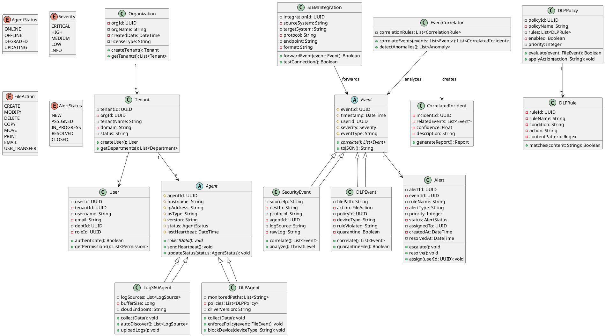

# Log360Cloud and DataSecurity Plus Integration Architecture

## Executive Summary

This document presents a comprehensive architecture for integrating **ManageEngine Log360Cloud** (Cloud-based SIEM) with **ManageEngine DataSecurity Plus** (DLP and File Auditing solution). The integration enables unified security monitoring by correlating Data Loss Prevention (DLP) events with broader security incidents, providing enhanced threat detection, compliance reporting, and incident response capabilities.

### Key Integration Benefits

- **Unified Security Visibility**: Centralized monitoring of DLP events alongside security incidents
- **Enhanced Threat Detection**: Correlation of file access patterns with security threats
- **Improved Compliance**: Consolidated audit trails for regulatory requirements (GDPR, HIPAA, PCI-DSS, SOX)
- **Faster Incident Response**: Contextual DLP events within broader security incidents
- **Scalable Cloud Architecture**: Leverages cloud storage and processing for unlimited scalability

---

## 1. System Architecture Overview

### 1.1 High-Level Architecture

```
┌─────────────────────────────────────────────────────────────────────┐
│                        Cloud Layer (Log360Cloud)                     │
│  ┌──────────────┐  ┌──────────────┐  ┌──────────────┐             │
│  │ Cloud SIEM   │  │ Analytics    │  │ Correlation  │             │
│  │ Engine       │  │ Engine       │  │ Engine       │             │
│  └──────────────┘  └──────────────┘  └──────────────┘             │
│  ┌──────────────────────────────────────────────────────┐          │
│  │        Zoho Logs - Cloud Storage & Indexing          │          │
│  └──────────────────────────────────────────────────────┘          │
└─────────────────────────────────────────────────────────────────────┘
                              ▲ ▲
                              │ │ Encrypted Log Transmission
                              │ │ (HTTPS/TLS)
┌─────────────────────────────┼─┼─────────────────────────────────────┐
│                             │ │        On-Premises Layer            │
│  ┌──────────────────────────┘ └────────────────────────┐           │
│  │                                                      │           │
│  ▼                                                      ▼           │
│ ┌────────────────────────┐              ┌────────────────────────┐ │
│ │  Log360Cloud Agent     │              │ DataSecurity Plus      │ │
│ │  - Log Collection      │◄────SIEM─────┤ - DLP Engine          │ │
│ │  - Auto-discovery      │  Integration │ - File Audit Engine   │ │
│ │  - Log Forwarding      │              │ - Agent Manager       │ │
│ └────────────────────────┘              └────────────────────────┘ │
│           │                                        │                │
│           │                                        │                │
│           ▼                                        ▼                │
│  ┌─────────────────────┐               ┌─────────────────────┐    │
│  │ Windows/Linux       │               │ DLP Agents          │    │
│  │ Servers & Endpoints │               │ (Minifilter Driver) │    │
│  │ - Active Directory  │               │ - File Servers      │    │
│  │ - File Servers      │               │ - Workstations      │    │
│  │ - Network Devices   │               │ - NAS (NetApp)      │    │
│  └─────────────────────┘               └─────────────────────┘    │
└─────────────────────────────────────────────────────────────────────┘
```

### 1.2 Component Description

#### Log360Cloud Components
- **Cloud SIEM Engine**: Security event correlation and threat detection
- **Cloud Storage (Zoho Logs)**: Distributed, encrypted log storage with indexing
- **Analytics Engine**: Real-time log analysis and pattern detection
- **Log360Cloud Agent**: Installed on endpoints for log collection and forwarding
- **Web Console**: Centralized management dashboard

#### DataSecurity Plus Components
- **DLP Engine**: Policy enforcement for data loss prevention
- **File Audit Engine**: Real-time file activity monitoring
- **Agent Manager**: Centralized agent deployment and configuration
- **DLP Agents**: Windows minifilter drivers on endpoints
- **Database Server**: PostgreSQL/MSSQL for local storage

---

## 2. Database Design

### 2.1 Unified Database Schema

The integration requires a unified schema that combines DLP events with security logs. Below is the comprehensive database design:

#### 2.1.1 Core Entity Relationship Diagram

```
┌─────────────────┐         ┌─────────────────┐         ┌─────────────────┐
│   Organization  │         │   Tenant        │         │   Department    │
├─────────────────┤         ├─────────────────┤         ├─────────────────┤
│ org_id (PK)     │────1:N──│ tenant_id (PK)  │────1:N──│ dept_id (PK)    │
│ org_name        │         │ org_id (FK)     │         │ tenant_id (FK)  │
│ created_date    │         │ tenant_name     │         │ dept_name       │
│ license_type    │         │ domain          │         │ manager_id      │
└─────────────────┘         │ status          │         └─────────────────┘
                            └─────────────────┘
                                    │
                                    │ 1:N
                                    ▼
                            ┌─────────────────┐
                            │   User          │
                            ├─────────────────┤
                            │ user_id (PK)    │
                            │ tenant_id (FK)  │
                            │ username        │
                            │ email           │
                            │ dept_id (FK)    │
                            │ role_id (FK)    │
                            │ status          │
                            └─────────────────┘
                                    │
                                    │ 1:N
                                    ▼
┌─────────────────┐         ┌─────────────────┐         ┌─────────────────┐
│   Agent         │         │   SecurityEvent │         │   DLPEvent      │
├─────────────────┤         ├─────────────────┤         ├─────────────────┤
│ agent_id (PK)   │────1:N──│ event_id (PK)   │         │ dlp_event_id(PK)│
│ agent_type      │         │ event_type      │         │ event_type      │
│ hostname        │         │ source_ip       │         │ user_id (FK)    │
│ ip_address      │         │ user_id (FK)    │         │ file_path       │
│ os_type         │         │ timestamp       │         │ action          │
│ version         │         │ severity        │         │ policy_id (FK)  │
│ status          │         │ agent_id (FK)   │         │ device_type     │
│ last_heartbeat  │         │ log_source      │         │ rule_violated   │
└─────────────────┘         │ raw_log         │         │ timestamp       │
                            │ indexed         │         │ severity        │
                            └─────────────────┘         │ quarantine      │
                                    │                   │ alert_sent      │
                                    │                   └─────────────────┘
                                    │
                                    │ 1:N
                                    ▼
                            ┌─────────────────┐
                            │   Alert         │
                            ├─────────────────┤
                            │ alert_id (PK)   │
                            │ event_id (FK)   │
                            │ rule_name       │
                            │ alert_type      │
                            │ priority        │
                            │ status          │
                            │ assigned_to     │
                            │ created_at      │
                            │ resolved_at     │
                            └─────────────────┘
```

### 2.2 Database Schema (SQL DDL)

See `database-schema.sql` for the complete SQL implementation.

### 2.3 Key Schema Features

1. **Multi-Tenancy Support**: Organization → Tenant hierarchy for MSSP deployments
2. **Agent Tracking**: Separate tables for Log360Cloud and DLP agents with status monitoring
3. **Event Correlation**: Foreign key relationships between security events and DLP events
4. **Audit Trail**: Comprehensive timestamp and user tracking
5. **Compliance**: Data retention policies and immutable audit logs
6. **Performance**: Indexed columns for fast querying (user_id, timestamp, event_type)

---

## 3. Agent Strategy

### 3.1 Dual Agent Architecture

Both Log360Cloud and DataSecurity Plus use independent agents. The integration strategy manages both without conflicts:

#### 3.1.1 Agent Deployment Strategy

```
┌─────────────────────────────────────────────────────────────────────┐
│                    Endpoint/Server                                  │
│                                                                     │
│  ┌────────────────────────────────────────────────────────────┐   │
│  │              Log360Cloud Agent                              │   │
│  │  - Port: 8800 (HTTP), 8999 (HTTPS), 9163 (Config)         │   │
│  │  - Service: Log360CloudAgent                               │   │
│  │  - Role: General log collection (OS, AD, apps)             │   │
│  │  - Buffer: 2GB offline cache                               │   │
│  └────────────────────────────────────────────────────────────┘   │
│                          ▲                                          │
│                          │ No Conflict                             │
│                          │ (Different Ports & Services)            │
│                          ▼                                          │
│  ┌────────────────────────────────────────────────────────────┐   │
│  │           DataSecurity Plus DLP Agent                       │   │
│  │  - Port: 8800 (Alt), 8999 (HTTPS Alt), 9163 (Alt)         │   │
│  │  - Service: DSPAgent                                        │   │
│  │  - Driver: Windows Minifilter                              │   │
│  │  - Role: File audit, DLP enforcement, USB control          │   │
│  │  - Buffer: 2GB offline cache                               │   │
│  └────────────────────────────────────────────────────────────┘   │
│                                                                     │
│  ┌────────────────────────────────────────────────────────────┐   │
│  │               Integration Layer                             │   │
│  │  - Syslog Forwarder (DLP → Log360)                         │   │
│  │  - Event Correlation Engine                                │   │
│  └────────────────────────────────────────────────────────────┘   │
└─────────────────────────────────────────────────────────────────────┘
```

#### 3.1.2 Agent Communication Flow

```
┌──────────────────┐                    ┌──────────────────┐
│ DLP Agent        │                    │ Log360 Agent     │
│ (Endpoint)       │                    │ (Endpoint)       │
└────────┬─────────┘                    └────────┬─────────┘
         │                                       │
         │ File Events                           │ System Logs
         │ DLP Events                            │ Security Events
         │ USB Activity                          │ AD Events
         ▼                                       ▼
┌──────────────────┐                    ┌──────────────────┐
│ DataSecurity+    │                    │ Log360Cloud      │
│ Server           │──── Syslog/API ───▶│ Agent Collector  │
│ (On-Prem)        │     Integration    │ (On-Prem)        │
└──────────────────┘                    └────────┬─────────┘
                                                 │
                                                 │ HTTPS/TLS
                                                 │ Encrypted
                                                 ▼
                                        ┌──────────────────┐
                                        │ Log360Cloud      │
                                        │ (Cloud SIEM)     │
                                        └──────────────────┘
```

### 3.2 Agent Deployment Matrix

| **Component** | **Agent Type** | **Installation Target** | **Port(s)** | **Communication** | **Purpose** |
|---------------|----------------|------------------------|-------------|-------------------|-------------|
| Log360Cloud | Log Collection Agent | All monitored endpoints, servers | 8800, 8999, 9163 | Bi-directional (Cloud ↔ Agent) | Collect system, application, and security logs |
| DataSecurity Plus | DLP Agent (Minifilter) | File servers, workstations, NAS | 8800*, 8999*, 9163* | Bi-directional (Server ↔ Agent) | File audit, DLP policy enforcement |
| Integration Layer | Syslog Forwarder | DataSecurity Plus Server | 514 (Syslog), 8999 (HTTPS) | Unidirectional (DSP → Log360) | Forward DLP events to SIEM |

*Note: DSP agents use configurable ports to avoid conflicts with Log360 agents*

### 3.3 Agent Management Strategy

#### 3.3.1 Installation Sequence
1. **Phase 1**: Deploy Log360Cloud agents to all endpoints for baseline monitoring
2. **Phase 2**: Deploy DLP agents to critical file servers and high-risk workstations
3. **Phase 3**: Configure SIEM integration (DSP → Log360Cloud)
4. **Phase 4**: Enable correlation rules and unified dashboards

#### 3.3.2 Configuration Management
- **Centralized Configuration**: Manage both agents from respective web consoles
- **Policy Synchronization**: DLP policies and log collection policies maintained separately
- **Version Control**: Independent update schedules for each agent type
- **Health Monitoring**: Unified dashboard showing status of all agents

#### 3.3.3 Conflict Resolution
- **Port Management**: Use port mapping to avoid conflicts (e.g., DSP on 8801 if 8800 is taken)
- **Resource Allocation**: Monitor CPU/memory usage; allocate minimum 2GB RAM per endpoint with both agents
- **Service Priority**: Log360 agent runs at normal priority; DLP agent at high priority (to capture all file events)
- **Offline Caching**: Both agents buffer up to 2GB during network outages

---

## 4. Class Diagram

### 4.1 Unified Object Model



### 4.2 Key Class Descriptions

#### Core Classes

**Organization**: Root entity for multi-tenant deployments (MSSP)
- Manages multiple tenants
- Handles licensing and top-level configuration

**Tenant**: Represents a single customer or business unit
- Owns users, agents, and policies
- Provides logical isolation

**User**: End-user entity with authentication and authorization
- Links to department and role
- Subject of audit trails

#### Agent Classes

**Agent (Abstract)**: Base class for all monitoring agents
- Common properties: status, heartbeat, version
- Polymorphic behavior for different agent types

**Log360Agent**: Specialized agent for log collection
- Auto-discovers log sources
- Uploads to cloud SIEM
- Handles offline buffering

**DLPAgent**: Specialized agent for DLP enforcement
- Monitors file system via minifilter driver
- Enforces DLP policies in real-time
- Controls device access (USB, CD, etc.)

#### Event Classes

**Event (Abstract)**: Base class for all security/DLP events
- Common metadata: timestamp, user, severity
- Correlation capabilities

**SecurityEvent**: SIEM security event
- Captures network activity, authentication, system changes
- Links to Log360Agent

**DLPEvent**: Data loss prevention event
- Captures file activities and policy violations
- Links to DLPAgent and DLPPolicy

#### Integration Classes

**SIEMIntegration**: Manages the connection between DSP and Log360Cloud
- Configures Syslog/Splunk forwarding
- Handles event transformation

**EventCorrelator**: Advanced analytics engine
- Correlates DLP events with security events
- Detects complex attack patterns

---

## 5. Integration Workflow

### 5.1 SIEM Integration Configuration

#### Step 1: Configure DataSecurity Plus for SIEM Export

```
DataSecurity Plus Web Console:
1. Navigate to: Configuration → Administration → SIEM Integration
2. Click: "+ Add Configuration"
3. Select: Syslog (recommended for Log360Cloud)
4. Configure:
   - SIEM Name: Log360Cloud
   - Server IP: <Log360 Agent IP>
   - Port: 514 (Syslog UDP) or 6514 (Syslog TCP/TLS)
   - Protocol: TCP (for reliability) or UDP
   - Standard: RFC 5424
   - Format: JSON or CEF (Common Event Format)
5. Test Connection
6. Save Configuration
```

#### Step 2: Configure Log360Cloud to Receive DLP Logs

```
Log360Cloud Web Console:
1. Navigate to: Admin → Log Sources → Add Log Source
2. Select: Syslog Server
3. Configure:
   - Source Name: DataSecurity Plus DLP
   - Listening Port: 514 or 6514
   - Protocol: TCP or UDP (match DSP config)
   - Parser: Custom parser for DLP events
4. Create Custom Parser:
   - Field Extraction: Extract user, file_path, action, policy_name
   - Severity Mapping: Map DSP severity to Log360 severity
5. Test & Validate
6. Enable Log Source
```

### 5.2 Event Flow Diagram

```
┌──────────────┐
│ File Server  │
│ Workstation  │
└──────┬───────┘
       │ File Activity
       ▼
┌──────────────────────┐
│ DLP Agent            │
│ (Minifilter Driver)  │
└──────┬───────────────┘
       │ 1. Capture Event
       ▼
┌──────────────────────┐
│ DLP Policy Engine    │
│ - Evaluate rules     │
│ - Apply actions      │
└──────┬───────────────┘
       │ 2. Policy Decision
       ▼
┌──────────────────────┐
│ DataSecurity Plus    │
│ Server               │
│ - Store locally      │
│ - Generate alert     │
└──────┬───────────────┘
       │ 3. Forward via Syslog
       ▼
┌──────────────────────┐
│ Log360 Agent         │
│ - Receive Syslog     │
│ - Parse event        │
└──────┬───────────────┘
       │ 4. Upload to Cloud
       ▼
┌──────────────────────┐
│ Log360Cloud SIEM     │
│ - Index event        │
│ - Correlate          │
│ - Alert/Report       │
└──────────────────────┘
       │ 5. Correlation
       ▼
┌──────────────────────┐
│ Security Operations  │
│ - Dashboard          │
│ - Investigation      │
│ - Response           │
└──────────────────────┘
```

### 5.3 Correlation Use Cases

#### Use Case 1: Insider Threat Detection

```
Scenario: Employee exfiltrating sensitive data

Event Sequence:
1. DLPEvent: User copies sensitive file to USB drive (High Severity)
2. SecurityEvent: Same user accesses file server after hours (Medium Severity)
3. SecurityEvent: User VPN login from unusual location (Medium Severity)
4. DLPEvent: User emails large attachment to personal email (High Severity)

Correlation Result:
→ CorrelatedIncident: "Potential Insider Threat"
→ Confidence: 95%
→ Action: Alert SOC, Block USB, Quarantine email
```

#### Use Case 2: Ransomware Detection

```
Scenario: Ransomware encrypting files

Event Sequence:
1. SecurityEvent: Suspicious process execution (Medium Severity)
2. DLPEvent: Mass file modification (100+ files in 1 minute) (Critical Severity)
3. DLPEvent: File extensions changed to .locked (Critical Severity)
4. SecurityEvent: Lateral movement detected (High Severity)

Correlation Result:
→ CorrelatedIncident: "Ransomware Attack"
→ Confidence: 99%
→ Action: Isolate endpoint, Block process, Alert CISO
```

---

## 6. API Integration Points

### 6.1 DataSecurity Plus REST API

```
Base URL: https://<dsp-server>:<port>/api/v1

Authentication: API Key or OAuth 2.0

Key Endpoints:
- GET /agents                    - List all DLP agents
- GET /events?from=<date>&to=<date> - Retrieve DLP events
- POST /policies                 - Create DLP policy
- PUT /policies/{id}             - Update DLP policy
- GET /alerts                    - Retrieve active alerts
- POST /alerts/{id}/resolve      - Resolve alert
```

### 6.2 Log360Cloud REST API

```
Base URL: https://api.zoho.com/log360cloud/v1

Authentication: OAuth 2.0

Key Endpoints:
- POST /logs/ingest              - Ingest custom logs
- GET /search?query=<lucene>     - Search indexed logs
- POST /alerts/create            - Create custom alert
- GET /dashboards/{id}           - Retrieve dashboard data
- POST /reports/generate         - Generate compliance report
```

### 6.3 Integration API Workflow

```python
# Example: Forward DLP high-severity events to Log360Cloud

import requests
import json

# 1. Fetch DLP events from DataSecurity Plus
dsp_api_key = "YOUR_DSP_API_KEY"
dsp_url = "https://dsp-server:8443/api/v1/events"
params = {
    "severity": "HIGH,CRITICAL",
    "from": "2024-01-01",
    "to": "2024-01-31"
}
headers = {"Authorization": f"Bearer {dsp_api_key}"}
response = requests.get(dsp_url, params=params, headers=headers)
dlp_events = response.json()

# 2. Transform and forward to Log360Cloud
log360_token = "YOUR_LOG360_OAUTH_TOKEN"
log360_url = "https://api.zoho.com/log360cloud/v1/logs/ingest"
headers = {
    "Authorization": f"Bearer {log360_token}",
    "Content-Type": "application/json"
}

for event in dlp_events:
    transformed_event = {
        "timestamp": event["timestamp"],
        "source": "DataSecurityPlus",
        "event_type": "DLP_VIOLATION",
        "user": event["username"],
        "file_path": event["file_path"],
        "action": event["action"],
        "severity": event["severity"],
        "policy": event["policy_name"]
    }
    requests.post(log360_url, json=transformed_event, headers=headers)
```

---

## 7. Security Considerations

### 7.1 Data Protection

- **Encryption in Transit**: All agent-to-server communication uses TLS 1.2+
- **Encryption at Rest**: Cloud storage encrypted with AES-256
- **Data Residency**: Configure Zoho Logs region (US, EU, APAC) for compliance
- **Retention Policies**: Configurable data retention (30 days to 7 years)

### 7.2 Access Control

- **Role-Based Access Control (RBAC)**: Define roles with granular permissions
- **Multi-Factor Authentication (MFA)**: Enforce MFA for administrative access
- **Audit Logging**: Track all configuration changes and data access
- **Separation of Duties**: DLP admin ≠ SIEM admin ≠ SOC analyst

### 7.3 Compliance

- **GDPR**: Data subject access requests, right to erasure
- **HIPAA**: PHI protection via DLP policies and encryption
- **PCI-DSS**: Cardholder data monitoring and alerts
- **SOX**: Financial data access auditing

---

## 8. Deployment Architecture

### 8.1 Small Deployment (< 500 Endpoints)

```
┌─────────────────────────────────────────┐
│         Log360Cloud (SaaS)              │
│  - Auto-scaling                         │
│  - Managed by ManageEngine              │
└─────────────────────────────────────────┘
                  ▲
                  │ HTTPS/TLS
                  │
┌─────────────────┴─────────────────┐
│      On-Premises                  │
│  ┌──────────────────────────────┐ │
│  │ Log360 Agent (Single Server) │ │
│  │ - 8GB RAM, 4 vCPU            │ │
│  │ - Receives Syslog from DSP   │ │
│  └──────────────────────────────┘ │
│  ┌──────────────────────────────┐ │
│  │ DataSecurity Plus Server     │ │
│  │ - 16GB RAM, 8 vCPU           │ │
│  │ - PostgreSQL Database        │ │
│  └──────────────────────────────┘ │
│  ┌──────────────────────────────┐ │
│  │ DLP Agents (Endpoints)       │ │
│  │ - ~500 workstations          │ │
│  └──────────────────────────────┘ │
└───────────────────────────────────┘
```

### 8.2 Medium Deployment (500 - 5000 Endpoints)

```
┌─────────────────────────────────────────┐
│         Log360Cloud (SaaS)              │
│  - Multi-region deployment              │
│  - Advanced correlation                 │
└─────────────────────────────────────────┘
                  ▲
                  │ HTTPS/TLS
                  │
┌─────────────────┴─────────────────┐
│      On-Premises                  │
│  ┌──────────────────────────────┐ │
│  │ Log360 Agent Cluster         │ │
│  │ - 3 servers (HA)             │ │
│  │ - 16GB RAM, 8 vCPU each      │ │
│  │ - Load balanced              │ │
│  └──────────────────────────────┘ │
│  ┌──────────────────────────────┐ │
│  │ DataSecurity Plus HA Cluster │ │
│  │ - 2 servers (Active-Standby) │ │
│  │ - 32GB RAM, 16 vCPU each     │ │
│  │ - PostgreSQL HA              │ │
│  └──────────────────────────────┘ │
│  ┌──────────────────────────────┐ │
│  │ DLP Agents (Endpoints)       │ │
│  │ - ~5000 workstations         │ │
│  └──────────────────────────────┘ │
└───────────────────────────────────┘
```

### 8.3 Large/Enterprise Deployment (> 5000 Endpoints)

```
┌─────────────────────────────────────────┐
│    Log360Cloud MSSP Edition (SaaS)      │
│  - Multi-tenant architecture            │
│  - Global load balancing                │
│  - Advanced threat intelligence         │
└─────────────────────────────────────────┘
                  ▲
                  │ HTTPS/TLS (Global)
                  │
┌─────────────────┴───────────────────────┐
│      Regional Data Centers              │
│  ┌────────────────────────────────────┐ │
│  │ Log360 Agent Farm (Region 1)       │ │
│  │ - 10+ servers                      │ │
│  │ - Auto-scaling                     │ │
│  │ - Geo-distributed                  │ │
│  └────────────────────────────────────┘ │
│  ┌────────────────────────────────────┐ │
│  │ DataSecurity Plus Enterprise       │ │
│  │ - Active-Active cluster            │ │
│  │ - Distributed database (Sharding)  │ │
│  │ - 64GB RAM, 32 vCPU per node       │ │
│  └────────────────────────────────────┘ │
│  ┌────────────────────────────────────┐ │
│  │ DLP Agents (Endpoints)             │ │
│  │ - 10,000+ workstations             │ │
│  │ - Tiered deployment                │ │
│  └────────────────────────────────────┘ │
└─────────────────────────────────────────┘
```

---

## 9. Implementation Roadmap

### Phase 1: Planning & Design (2-4 weeks)
- [ ] Assess current infrastructure
- [ ] Define integration requirements
- [ ] Design network architecture
- [ ] Plan agent deployment strategy
- [ ] Define DLP policies
- [ ] Create correlation rules

### Phase 2: Pilot Deployment (4-6 weeks)
- [ ] Deploy Log360Cloud agents (100 endpoints)
- [ ] Deploy DLP agents (50 critical servers)
- [ ] Configure SIEM integration
- [ ] Test event correlation
- [ ] Validate dashboards and reports
- [ ] Train SOC team

### Phase 3: Production Rollout (8-12 weeks)
- [ ] Deploy Log360Cloud agents (all endpoints)
- [ ] Deploy DLP agents (all file servers and high-risk workstations)
- [ ] Enable production monitoring
- [ ] Configure alerting
- [ ] Document procedures

### Phase 4: Optimization (Ongoing)
- [ ] Tune correlation rules
- [ ] Optimize DLP policies
- [ ] Review and adjust alerting thresholds
- [ ] Quarterly architecture review

---

## 10. Monitoring & Operations

### 10.1 Health Monitoring

```
Key Metrics to Monitor:

1. Agent Health
   - Online/Offline status
   - Heartbeat frequency
   - Version compliance
   - Resource usage (CPU, memory, disk)

2. Integration Health
   - Syslog delivery rate
   - Event processing latency
   - Failed event count
   - Queue depth

3. System Performance
   - Events per second (EPS)
   - Log ingestion rate
   - Query response time
   - Storage utilization

4. Security Metrics
   - DLP violations per day
   - Critical alerts count
   - Mean time to detect (MTTD)
   - Mean time to respond (MTTR)
```

### 10.2 Alerting Strategy

```
Alert Tier 1 (Critical - Immediate Response)
- Ransomware detected
- Mass data exfiltration
- Privileged account compromise
- Agent tampering detected

Alert Tier 2 (High - 1-hour SLA)
- Multiple DLP policy violations
- Unusual file access patterns
- Failed authentication attempts (brute force)
- Malware detected

Alert Tier 3 (Medium - 4-hour SLA)
- Policy violations (single occurrence)
- Unauthorized device usage
- Configuration changes

Alert Tier 4 (Low - 24-hour SLA)
- Informational events
- Scheduled report failures
- Agent update available
```

---

## 11. Troubleshooting Guide

### 11.1 Common Issues

#### Issue: DLP events not appearing in Log360Cloud

**Resolution**:
1. Verify Syslog configuration in DataSecurity Plus
2. Check network connectivity between DSP server and Log360 agent
3. Verify firewall rules allow Syslog traffic (port 514/6514)
4. Check Log360 custom parser configuration
5. Review DSP server logs: `/opt/manageengine/datasecurity/logs/`

#### Issue: Agents showing offline

**Resolution**:
1. Check agent service status: `sc query <servicename>`
2. Verify network connectivity to management server
3. Check local firewall rules
4. Review agent logs for errors
5. Restart agent service

#### Issue: High latency in event processing

**Resolution**:
1. Check Log360Cloud cloud status
2. Verify agent buffer size configuration
3. Review network bandwidth utilization
4. Consider increasing agent resources
5. Enable compression for log transmission

---

## 12. Conclusion

This architecture provides a comprehensive, scalable, and secure integration between Log360Cloud and DataSecurity Plus. Key benefits include:

1. **Unified Security Visibility**: Single pane of glass for DLP and SIEM
2. **Advanced Threat Detection**: Correlation of file activities with security events
3. **Regulatory Compliance**: Comprehensive audit trails and reporting
4. **Scalability**: Cloud-based SIEM scales infinitely
5. **Cost Efficiency**: Reduced infrastructure costs with cloud deployment

### Next Steps

1. Review this architecture with stakeholders
2. Plan pilot deployment
3. Configure test environment
4. Develop custom correlation rules
5. Train security operations team

### References

- [ManageEngine Log360Cloud Documentation](https://www.manageengine.com/cloud-siem/)
- [DataSecurity Plus Documentation](https://www.manageengine.com/data-security/)
- [SIEM Integration Guide](https://www.manageengine.com/data-security/help/settings/siem-integration.html)
- [Log360 Architecture PDF](https://www.manageengine.com/cloud-siem/solution-architecture.pdf)

---

**Document Version**: 1.0  
**Last Updated**: December 2024  
**Author**: Enterprise Security Architecture Team
